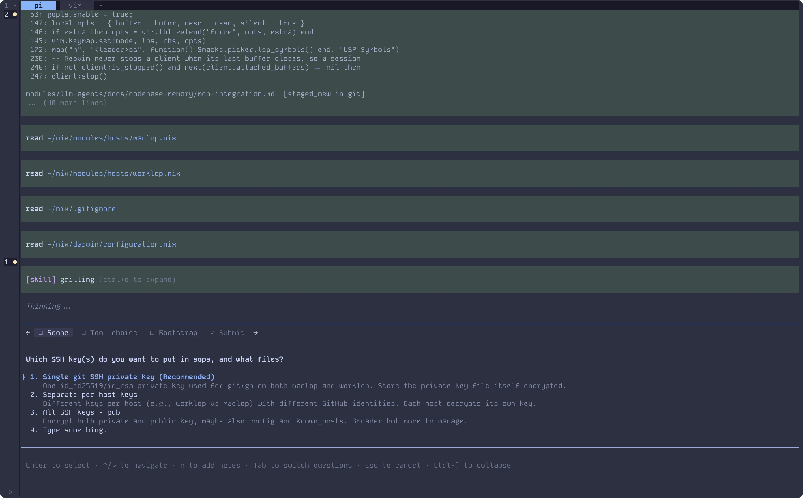
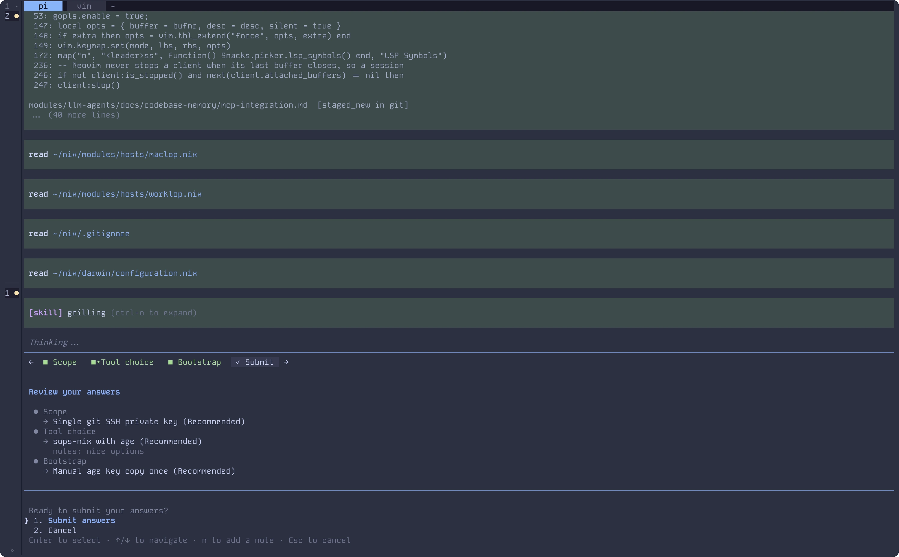
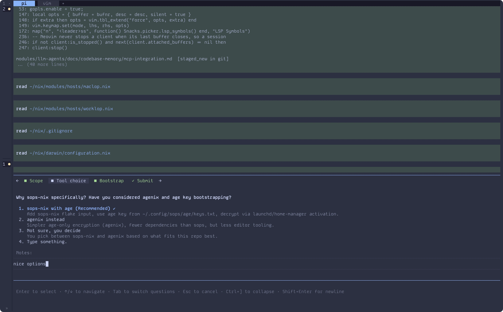

# pi-ask-popup

Let the model ask you instead of guessing. This Pi extension registers one tool, `ask_user_question`, that opens a terminal dialog of up to four questions with written-out options, and hands your choices back as structured data.



## Install

```sh
pi install npm:pi-ask-popup
```

Restart your Pi session.

```sh
pi --version  # needs 0.80 or newer
node --version  # needs 22 or newer
```

No runtime dependencies, no build step, no API keys. The extension makes no model calls of its own.

## Quick start

Give the model a task with a real decision in it:

> Add caching to the API client.

Rather than picking for you, the model calls `ask_user_question` and a dialog takes over the bottom of your terminal. Move with `Up` and `Down`, pick with `Enter`, or land on `Type something.` to answer in your own words. While typing, `Shift+Enter` adds a line, `Ctrl+G` opens Pi's external editor, `Ctrl+U` clears the draft, and `Esc` cancels the whole questionnaire. Pressing `n` adds a note to the current question. The questionnaire stays in one place until you submit.

When the model asks several things at once, `Tab` moves between questions and a Submit tab reviews everything before it goes back:



A note written on a question you never answer still reaches the model, and a global note from the Submit tab covers the whole questionnaire:



## What it does

- **Typed options, not a wall of prose.** Each question carries 2 to 4 authored choices, and every choice explains what it means or what it costs you.
- **You can always answer in your own words.** A `Type something.` row is added to every question and widens to the full pane while you type.
- **Compare artifacts, not labels.** An option can carry a markdown `preview` that renders in a bordered box beside the option list.
- **One interruption, not five.** Up to four questions arrive in a single tabbed dialog, and a Submit tab names anything still blank before you commit.
- **Notes on any answer, or on all of them.** `n` opens a note editor on any question tab, and on the Submit tab it writes one note covering everything. A written note stays on its tab, dimmed, and the tab bar marks which tabs carry one. A note on a question you never answer still reaches the model as `unansweredNotes`.
- **Read the transcript behind it.** `Ctrl+]` collapses the dialog and brings it back with your answers intact.
- **A timeout that is not a decline.** Pass `timeout` in milliseconds and the dialog shows a live countdown. If it expires, the tool returns `cancelled: true` with `error: "timed_out"`, not a refusal. The model can retry or fall back to asking as plain text.
- **Works outside the terminal.** RPC and ACP hosts such as Zed or the VS Code pendant walk the host's native dialogs instead.

## Configuration

Optional. Settings live in `pi-ask-popup.json`. Two layers, project overrides global:

| Layer | Path | When it is read |
| --- | --- | --- |
| Global | `~/.pi/agent/pi-ask-popup.json` | Always |
| Project | `<project>/.pi/pi-ask-popup.json` | Only when the workspace is trusted |

| Setting | What it does | Default |
| --- | --- | --- |
| `collapseKey` | Key that collapses and expands the dialog. Accepts Pi keybinding ids such as `alt+o`. Use `"off"` to disable. | `"ctrl+]"` |
| `guidance.description` | Full replacement for the tool description the model sees. | built-in description |
| `guidance.promptSnippet` | One-line summary of the tool in the system prompt. | built-in snippet |
| `guidance.promptGuidelines` | Usage guidelines given to the model, as a list of strings. | 5 built-in guidelines |

Guidance is read from the global layer only. A checked-in file should not be able to change what the agent is told. `collapseKey` can be set per project.

```json
{
  "collapseKey": "alt+o"
}
```

A bad field is dropped back to its default without a warning. A whole file with bad JSON is ignored with a warning shown on the next tool call. See [Configuration](./docs/configuration.md) for the full grammar for `collapseKey`, file lookup, and how warnings are shown.

## Reference

- [Tool schema](./docs/tool-schema.md): params, limits, reserved labels, `timeout`, validation errors, the result shape, and the `pi-ask-popup:*` events.
- [Keyboard and layout](./docs/keyboard.md): every key, the rows the dialog adds, notes, collapse mode, countdown, and how previews and overflow adapt to terminal size.
- [Configuration](./docs/configuration.md): file lookup, the `collapseKey` grammar, the `guidance.*` prompt overrides, and how bad values are handled.
- [Hosts and runtime behavior](./docs/hosts.md): terminal vs RPC vs non-interactive, what changes in each, and the `session_load_failed` and `stale_module_cache` cases.

## Requirements

- Node.js 22 or newer
- Pi Agent 0.80 or newer, with an interactive terminal or an RPC or ACP host. Non-interactive runs never see the tool.
- A terminal at least 100 columns wide for side by side previews. Narrower terminals stack the preview under the options.

## Troubleshooting

**The model says the questionnaire UI failed to load and asks its questions as chat text.**

The dialog modules were replaced on disk while Pi was running, usually by a package manager install that touched the store. Repair the install if it is broken, then restart Pi. See [Hosts](./docs/hosts.md) for `session_load_failed` and `stale_module_cache`.

**`Ctrl+]` does nothing.**

On layouts where `]` is on the shifted layer, like Latin American Spanish `es-AR` and `es-MX`, the default is unreachable. Set `collapseKey` to something you can type:

```json
{
  "collapseKey": "alt+o"
}
```

Or use `"off"` to disable the shortcut. The footer hint inside the dialog and the collapsed one-line hint both name whatever key you set.

**Side by side preview never appears.**

Both the terminal and the dialog pane must be at least 100 columns wide. Below that the preview stacks under the options. The preview pane only appears for single-select questions.

## How this relates to other packages

This is a fork of [`@juicesharp/rpiv-ask-user-question`](https://github.com/juicesharp/rpiv-mono/tree/main/packages/rpiv-ask-user-question) by juicesharp, MIT licensed. The fork removes the `rpiv-config` and `rpiv-i18n` dependencies, so there is no localization and no XDG config path. Config lives in `~/.pi/agent/pi-ask-popup.json` with a per-project override in `<project>/.pi/pi-ask-popup.json`, and only when the workspace is trusted. It targets Pi 0.80 and later, and it adds a `timeout` with a distinct `timed_out` result.

If you want something smaller, [`pi-ask-user`](https://www.npmjs.com/package/pi-ask-user) by Enzo Lucchesi does a comparable job in far less code, with a searchable split-pane selector instead of tabs and previews. Pick whichever fits your setup. The README notes both so you can choose with full information.

## License

MIT. See [LICENSE](LICENSE) for both copyright holders.
