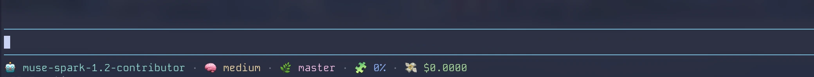
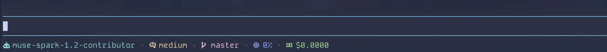
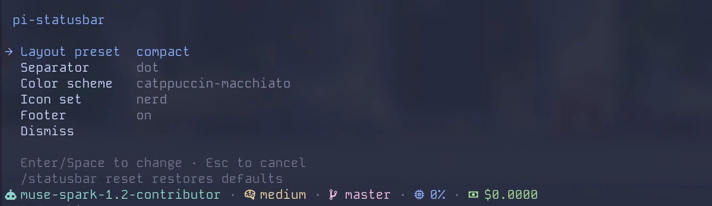
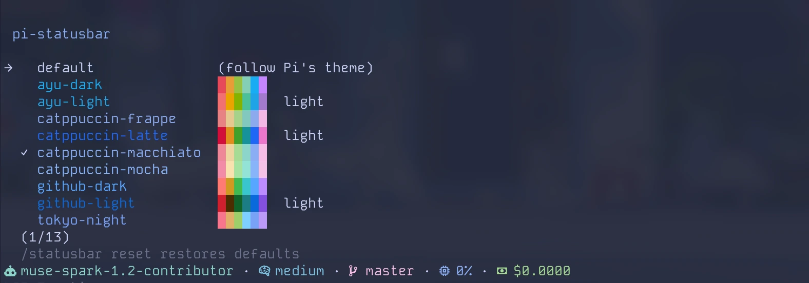

# pi-status-widget

A footer for [pi](https://pi.dev) with three presets, emoji or nerd font icons, twelve color schemes, and a thinking level segment that changes color with the level.

Derived from [pi-footer](https://github.com/wobondar/pi-footer) by wobondar, MIT licensed. This package keeps 14 widgets, three presets, no config UI, and no runtime dependencies. If you want powerline segments, an in terminal config editor, or 56 widgets, pi-footer is the better fit.




## Install

```sh
pi install npm:pi-status-widget
```

Restart your pi session. For a one off try without installing:

```sh
pi -e npm:pi-status-widget
```

### Requirements

- Node 22 or newer
- pi 0.80 or newer
- A Nerd Font only if you choose `icons nerd`. `emoji` is the default and needs no patched font.
- Truecolor terminal to see a color scheme as designed. Below truecolor every scheme falls back to the nearest of the basic 16 colors.

## What it shows

Three presets, switched with one command. Each preset is one line unless you edit the config file to add more.

| Preset | Separator | Widgets |
| --- | --- | --- |
| `default` | `dot` | provider and model, thinking level, context length, git branch, git diff compact, session cost, elapsed time |
| `compact` | `space` | model, thinking level, git branch, context percent, cost |
| `git-heavy` | `dot` | provider and model, directory name, branch, short SHA, working tree counts, diff compact, ahead and behind |

Examples from a real terminal:

- `default`: `anthropic/claude-sonnet-4  high  42k  main (+12,-3)  $0.42  12m`
- `compact`: `claude-sonnet-4  high  main  25%  $0.42`
- `git-heavy`: `anthropic/claude-sonnet-4  my-app  main  a1b2c3d  +2 ±1 ?0  (+12,-3)  ↑1 ↓0`

The text above is before icons and colors. With emoji you see `🤖`, `🧠`, `🌿`, and so on. With nerd you see the same spots with Nerd Font glyphs.

## Icon modes

```sh
/statusbar icons emoji
/statusbar icons nerd
```

- `emoji` is the default. It works in any terminal.
- `nerd` needs a Nerd Font. Without it the glyphs will show as missing boxes.

An explicit icon choice sticks. Switching presets does not overwrite it, because the font is a property of the terminal, not the layout.

## Thinking level color

The thinking segment colors itself from the level, using the same colors pi uses for its own thinking indicator.

| Level | Theme color | Fallback |
| --- | --- | --- |
| `off` | `thinkingOff` | `brightBlack` |
| `minimal` | `thinkingMinimal` | `blue` |
| `low` | `thinkingLow` | `cyan` |
| `medium` | `thinkingMedium` | `yellow` |
| `high` | `thinkingHigh` | `magenta` |
| `xhigh` | `thinkingXhigh` | `red` |
| `max` | `thinkingMax` | `brightRed` |

How it resolves:

1. If a color scheme is active, the scheme provides the color for that level and the theme is not asked. This keeps the whole footer in one palette.
2. Otherwise pi theme color for that level, if the loaded theme defines it.
3. Otherwise the fallback in the table above.
4. If no level is reported by the model, the widget uses its configured `fg`.

The color follows the active pi theme. Change the theme in `/settings` and the thinking color changes with it.

Turn it off per widget with `thinkingLevelColors: false` in the config file.

## Color schemes

A scheme recolors this footer and nothing else. It does not change pi's theme, which lives in `/settings`. Choosing `github-light` here leaves your editor and prompt as they were.




Pick one from the `Color scheme` row in `/statusbar` or name it directly:

```text
/statusbar colors tokyo-night
/statusbar colors default
```

`default` is the shipped value and means inherit. Every color stays whatever pi theme decides. It is also the way back out of a scheme.

Schemes marked light expect a light terminal background. Nothing stops you using one on a dark terminal, but it was not drawn for it.

- ayu: `ayu-dark`, `ayu-light` (light)
- catppuccin: `catppuccin-frappe`, `catppuccin-latte` (light), `catppuccin-macchiato`, `catppuccin-mocha`
- github: `github-dark`, `github-light` (light)
- tokyo night: `tokyo-night`, `tokyo-night-day` (light), `tokyo-night-moon`, `tokyo-night-storm`

Only foregrounds. A scheme never fills a background, so the footer keeps sitting on your terminal background and a light scheme cannot paint a bright band across a dark screen.

### A scheme needs truecolor

Every scheme is 24 bit color, so a scheme looks like itself only where your terminal can show 24 bit color. Below truecolor each color falls back to the nearest of the basic 16, which your terminal then paints from its own palette. The footer still works and still picks up the shape of the scheme, but the result sits close to what you saw with no scheme at all. If you chose a scheme and almost nothing changed, this is why.

pi decides this once, and this footer follows that decision rather than guessing. kitty, ghostty, WezTerm, Warp, iTerm2 and Windows Terminal are recognised. Under tmux or screen it depends on `COLORTERM` being `truecolor` or `24bit`. Setting `terminal.trueColor` in pi settings overrides the lot.

### Reaching a color no scheme offers

A widget `fg` in the config file names a slot, and the active scheme decides what that slot looks like. `fg: "brightCyan"` is the terminal brightCyan under `default` and the scheme brightCyan under a scheme, and the widget never knows which. Naming a slot and then choosing a scheme is how you reach a color no single setting offers.

The slots are the sixteen ANSI names, `black` through `brightWhite`, plus `default` to inherit, and `pi:<name>` for one of pi own theme colors. A hex is not accepted. No scheme could restyle it, and one way for color to reach the footer is worth more than two.

## Command reference

Bare command opens the settings panel or prints state when no UI is present. Every mutation saves to disk and repaints immediately. A failed write notifies rather than throwing.

```text
/statusbar                                    open the settings panel
/statusbar preset <default|compact|git-heavy> switch layout
/statusbar separator <none|dot|pipe|space|powerline|dash|comma>
/statusbar icons <emoji|nerd>                 switch icon set
/statusbar colors <scheme>                    the panel lists every scheme
/statusbar on | off                           show or hide the footer
/statusbar reset                              restore defaults
```

Bare `/statusbar` prints:

```text
pi-statusbar on · preset default · separator dot · icons emoji
colors default
~/.pi/agent/extensions/pi-statusbar.json

Usage:
  ...
```

Settings panel rows:

| Row | What it changes | Values |
| --- | --- | --- |
| Layout preset | Preset plus its separator | `default`, `compact`, `git-heavy` |
| Separator | Global separator between widgets | `none`, `dot`, `pipe`, `space`, `powerline`, `dash`, `comma` |
| Color scheme | Footer palette | `default` plus twelve names, each shown in its own colors with a swatch |
| Icon set | Glyph set | `emoji`, `nerd` |
| Footer | Enabled | `on`, `off` |

Color scheme row opens a picker. Move the cursor to preview each scheme on the real footer. Press Enter to commit, Escape to go back to the scheme you opened with. The preview writes nothing until you commit.

Separator row cycles with left and right arrows. Color scheme row does not cycle in place because thirteen entries is too many to step through one at a time.

## Config file

File path is `~/.pi/agent/extensions/pi-statusbar.json`. Override it with `PI_STATUSBAR_CONFIG`.

If the file is missing you get defaults. If the file is not valid JSON you get defaults and a warning. An unknown preset, separator, icon mode, or scheme name falls back to default rather than failing to load. An unknown widget type in a hand edited file is dropped.

### Shape

```json
{
  "version": 1,
  "enabled": true,
  "preset": "default",
  "separator": "dot",
  "separatorFg": "default",
  "separatorBg": "default",
  "iconMode": "emoji",
  "colorScheme": "default",
  "lines": [
    [
      { "id": "model-provider-demo", "type": "model-provider", "enabled": true, "options": {} },
      { "id": "thinking-level-demo", "type": "thinking-level", "enabled": true, "options": { "thinkingLevelColors": true } }
    ]
  ]
}
```

| Field | Type | Default | Notes |
| --- | --- | --- | --- |
| `version` | `1` | `1` | Fixed |
| `enabled` | boolean | `true` | `false` hides the footer |
| `preset` | string | `default` | `default`, `compact`, `git-heavy` |
| `separator` | string | per preset | `none`, `dot`, `pipe`, `space`, `powerline`, `dash`, `comma` |
| `separatorFg` | ColorName | `default` | Named color, see below |
| `separatorBg` | ColorName | `default` | Named color, see below |
| `iconMode` | string | `emoji` | `emoji`, `nerd` |
| `colorScheme` | string | `default` | `default` or one of twelve |
| `lines` | `WidgetEntry[][]` | per preset | Array of lines, each a list of widget entries |

`ColorName` is `default` to inherit, one of sixteen ANSI names `black` through `brightWhite`, or `pi:<themeColor>` for a pi theme color. Hex is rejected.

### Widgets

Fourteen types exist. Each entry has `type`, `enabled`, and `options`. Common options on every widget are `fg`, `bg`, `bold`, plus per widget `raw`, `icon`, `hideWhenEmpty`, `hideWhenZero`, `text` where listed.

| Type | Shows | Base options | Extra properties |
| --- | --- | --- | --- |
| `model` | Active model id | `raw`, `icon` | `showProvider` boolean, default `false` |
| `model-provider` | Provider and model as `provider/model` | `raw`, `icon` | none |
| `thinking-level` | Reasoning level for models that report it | `raw`, `hideWhenEmpty`, `icon`, `text` | `thinkingLevelColors` boolean, default `true` |
| `cwd-basename` | Name of current directory | `raw`, `hideWhenEmpty`, `icon`, `text` | none |
| `context` | Context usage percent | `raw`, `icon` | `warningThreshold` number, `dangerThreshold` number, `warningFg`, `dangerFg`, `tokenFormatStyle` |
| `context-length` | Context size as token count | `raw`, `hideWhenZero`, `icon` | `tokenFormatStyle` choice `default` `compact`, plus same warning and danger thresholds and colors as `context` |
| `cost` | Session cost | `raw`, `icon` | `costFormatStyle` choice `default` `compact`, `showSubscription` boolean |
| `total-time` | Wall clock since first session entry | `raw`, `icon` | none |
| `git-branch` | Branch name, hidden outside a repo | `raw`, `hideWhenEmpty`, `icon`, `text` | `gitBranchDisplayStyle` choice `default` `round-brackets` `custom`, `surroundLeft` text, `surroundRight` text |
| `git-sha` | Short HEAD SHA | `raw`, `hideWhenEmpty`, `icon`, `text` | none |
| `git-status` | Staged, unstaged, untracked counts | `raw`, `hideWhenEmpty`, `icon`, `text` | none |
| `git-diff` | Insertions and deletions | `raw`, `hideWhenEmpty`, `icon`, `text` | `gitDiffMode` choice `plain` `compact` |
| `git-ahead-behind` | Ahead and behind vs upstream | `raw`, `hideWhenEmpty`, `icon`, `text` | none |
| `flex-separator` | Pushes following widgets to the right | none | none |

Decorations like `fg: "cyan"` or `bold: true` sit inside `options` next to the properties above.

## How it differs from pi-footer

pi-footer is the larger package and the right choice if you want powerline segments, an in terminal config editor, or any of its 56 widgets. This one keeps 14 widgets, three presets, no config UI, and no runtime dependencies. Both read the same pi extension APIs, so footer data like `getGitBranch` comes from the same source.

## Notes on terminals and colors

- The extension honors `NO_COLOR`. Any non empty value disables colors.
- `pi:<themeColor>` delegates to `theme.fg` and only affects foregrounds. Pi exposes no arbitrary background there.
- Below truecolor, schemes degrade to the basic 16. That is intentional while keeping scope small. It means every scheme still loads, it just looks close to `default`.

## License

MIT. See [LICENSE](LICENSE) for both copyright holders, wobondar first, then derangga.
